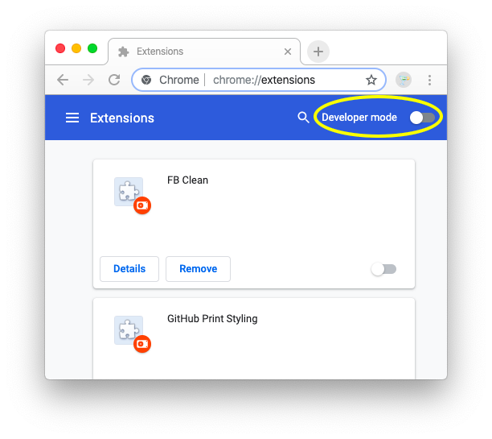
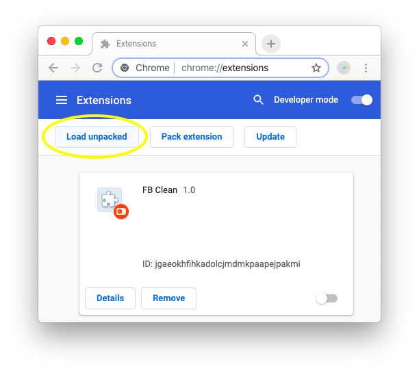
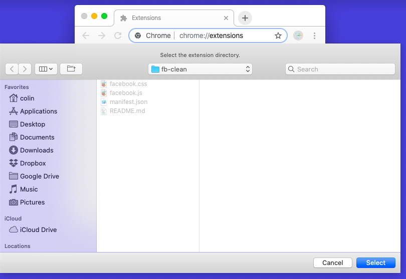
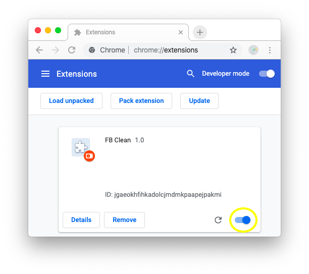

# Installing Chrome Extensions

Clone this repository
```
git clone https://github.com/bluegraybox/fb-clean.git
```

Or [download it as a zip file](https://github.com/bluegraybox/fb-clean/archive/master.zip) and unzip it.

Open the [Chrome extension manager](chrome://extensions/).

Turn on Developer Mode by clicking the button in the upper right.



Click Load Unpacked button



Navigate to the directory where the code is.



Refresh Facebook.

If you don't like the way it looks, you can disable this extension by clicking on the button in the lower right of its box.


